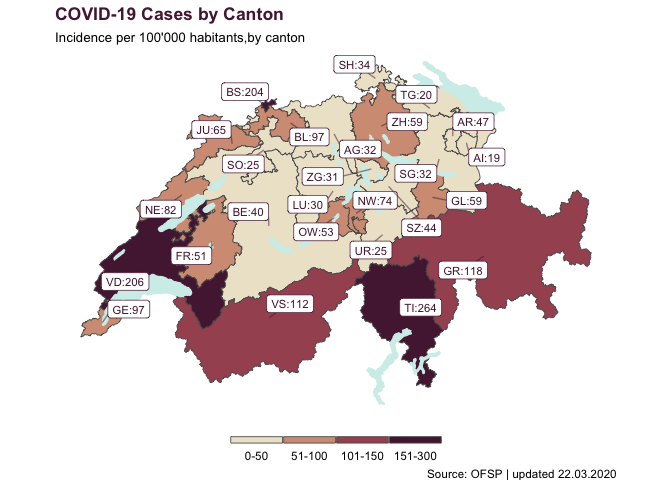

# Creating a map of Incidence of COVID-19 in Switzerland, by canton

``` r
library(tidyverse)
library(sf)
library(rcartocolor)
```

## Import data

``` r
swiss_incidence <- read_csv("resources/data-Ynlb2.csv")
```

    ## Parsed with column specification:
    ## cols(
    ##   ID = col_character(),
    ##   Value = col_double()
    ## )

## Import shapes

``` r
swiss_border <- st_read("resources/g2l15.shp")
```

    ## Reading layer `g2l15' from data source `/Users/gruggeri/Documents/ADSCV/ADSCV_media/static_map_covid/resources/g2l15.shp' using driver `ESRI Shapefile'
    ## Simple feature collection with 1 feature and 12 fields
    ## geometry type:  POLYGON
    ## dimension:      XY
    ## bbox:           xmin: 485411 ymin: 75286.54 xmax: 833837.9 ymax: 295933.8
    ## epsg (SRID):    21781
    ## proj4string:    +proj=somerc +lat_0=46.95240555555556 +lon_0=7.439583333333333 +k_0=1 +x_0=600000 +y_0=200000 +ellps=bessel +towgs84=674.374,15.056,405.346,0,0,0,0 +units=m +no_defs

``` r
swiss_lakes <- st_read("resources/g2s15.shp")
```

    ## Reading layer `g2s15' from data source `/Users/gruggeri/Documents/ADSCV/ADSCV_media/static_map_covid/resources/g2s15.shp' using driver `ESRI Shapefile'
    ## Simple feature collection with 22 features and 9 fields
    ## geometry type:  MULTIPOLYGON
    ## dimension:      XY
    ## bbox:           xmin: 500253.8 ymin: 63872.4 xmax: 774495.3 ymax: 297632.2
    ## epsg (SRID):    21781
    ## proj4string:    +proj=somerc +lat_0=46.95240555555556 +lon_0=7.439583333333333 +k_0=1 +x_0=600000 +y_0=200000 +ellps=bessel +towgs84=674.374,15.056,405.346,0,0,0,0 +units=m +no_defs

``` r
swiss_cantons <- st_read("resources/G1K09.shp")
```

    ## Reading layer `G1K09' from data source `/Users/gruggeri/Documents/ADSCV/ADSCV_media/static_map_covid/resources/G1K09.shp' using driver `ESRI Shapefile'
    ## Simple feature collection with 26 features and 3 fields
    ## geometry type:  MULTIPOLYGON
    ## dimension:      XY
    ## bbox:           xmin: 485414 ymin: 75286 xmax: 833837 ymax: 295935
    ## epsg (SRID):    21781
    ## proj4string:    +proj=somerc +lat_0=46.95240555555556 +lon_0=7.439583333333333 +k_0=1 +x_0=600000 +y_0=200000 +ellps=bessel +towgs84=674.374,15.056,405.346,0,0,0,0 +units=m +no_defs

``` r
canton_codes <- tibble::tribble(
                    ~ID,  ~code, ~code_numeric,  
                    "Aargau", "AG",  19, 
     "Appenzell Innerrhoden", "AI",  15, 
    "Appenzell Ausserrhoden", "AR",  16, 
                     "Bern", "BE",   2, 
          "Basel-Landschaft", "BL",  13, 
               "Basel-Stadt", "BS",  12, 
                  "Fribourg", "FR",  10,
                    "Genève", "GE",  25,
                    "Glarus", "GL",   8,
                   "Graubünden", "GR",  18,
                      "Jura", "JU",  26,
                   "Luzern", "LU",   3, 
                 "Neuchâtel", "NE",  24, 
                 "Nidwalden", "NW",   7, 
                  "Obwalden", "OW",   6, 
                "Sankt Gallen", "SG",  17, 
              "Schaffhausen", "SH",  14, 
                 "Solothurn", "SO",  11, 
                    "Schwyz", "SZ",   5, 
                   "Thurgau", "TG",  20, 
                    "Ticino", "TI",  21, 
                       "Uri", "UR",   4, 
                      "Vaud", "VD",  22, 
                    "Valais", "VS",  23, 
                       "Zug", "ZG",   9, 
                    "Zürich", "ZH",   1
    )
```

## Joining data and geometries together

``` r
swiss_incidence <- swiss_incidence %>% 
  left_join(canton_codes, "ID")
```

``` r
swiss_cantons <- swiss_cantons %>% 
  left_join(swiss_incidence, c("KURZ" = "code"))
```

    ## Warning: Column `KURZ`/`code` joining factor and character vector, coercing
    ## into character vector

## Divide incidence into categories

``` r
swiss_cantons <- swiss_cantons %>% 
  mutate(incidence_cat = case_when(
    Value <= 50 ~ "0-50",
    Value <= 100 ~ "51-100",
    Value <= 150 ~ "101-150",
    Value <= 300 ~ "151-300"
  )) %>% 
  mutate(incidence_cat = factor(incidence_cat, levels = c("0-50", "51-100",
                                                          "101-150",
                                                          "151-300")))
```

## Plot the data

``` r
ggplot(swiss_cantons) +
  geom_sf(aes(fill = incidence_cat), size = 0.3) +
  scale_fill_carto_d(palette = "BrwnYl",
                     guide = guide_legend(direction = "horizontal",
            keyheight = unit(2, units = "mm"),
            keywidth = unit(70 / 5, units = "mm"),
            title.position = 'top',
            title.hjust = 0.5,
            label.hjust = 0.5,
            nrow = 1,
            byrow = T,
            label.position = "bottom")) +
  geom_sf(data = swiss_lakes, fill = "#d1eeea", color = "#d1eeea")+
  ggrepel::geom_label_repel(
    data = swiss_cantons,
    aes(label = paste0(KURZ,":",round(Value, digits = 0)), 
        geometry = geometry),
    stat = "sf_coordinates",
    min.segment.length = 0.2,
    colour = "#541f3f",
    size = 3,
    segment.alpha = 0.5
  ) +
  labs(title = "<b style='color:#541f3f'> COVID-19 Cases by Canton </b>",
       subtitle = "<span style='font-size:10pt'>Incidence per 100'000 habitants,by canton </span>",
       caption = "Source: OFSP | updated 22.03.2020") +
  theme_void() +
  theme(legend.title = element_blank(),
        legend.position = "bottom",
        plot.title = ggtext::element_markdown(),
        plot.subtitle = ggtext::element_markdown())
```

<!-- -->

``` r
# Save the plot
# ggsave(filename = "Incidence.jpg", height = 5, width = 7)
```
