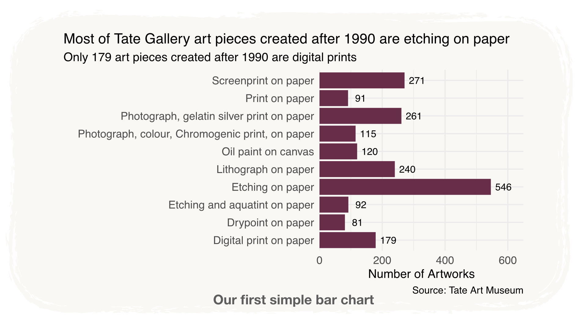
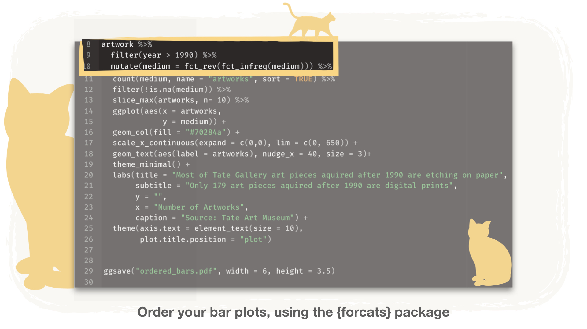
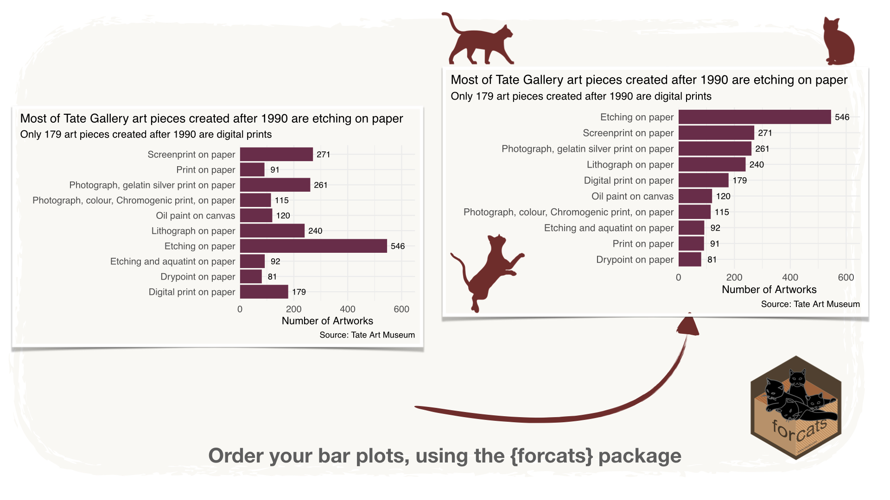
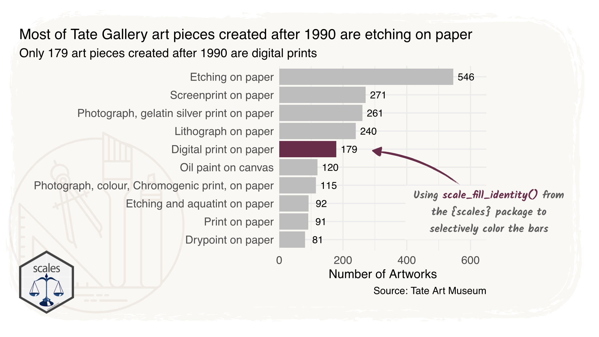
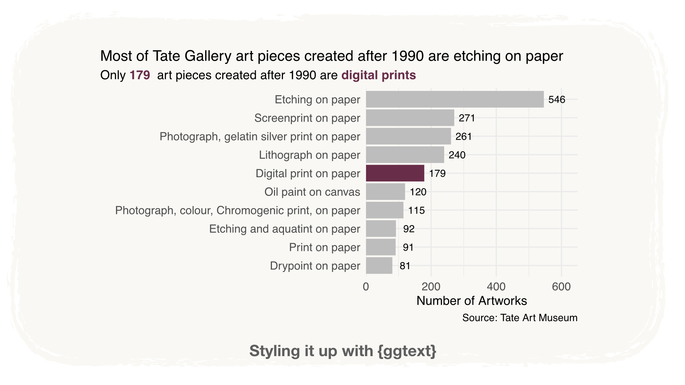
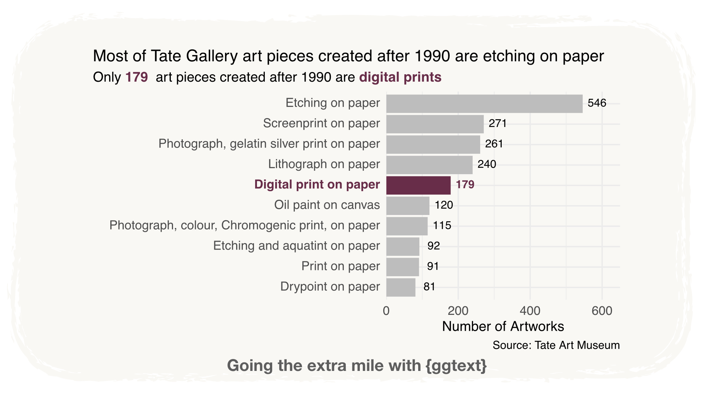

## Styling a chart using `{forcats}` and `{ggtext}` and `{scales}`


```{r setup, include=FALSE}
knitr::opts_chunk$set(echo = TRUE, message = FALSE, warning = FALSE)
```

After seeing the talk of John Burn-Murdoch at R Studio conference I have decided
to show how to put in practice one of his tips for better data communication: democratise plots with text. He indeed showed the importance of the text in charts, as the audience will first look through the title, the axis title and only after that it will focus on the area of the chart.
The title and subtitle then become a key tool for our data communication, that should not be overlooked and that should already try to convey a message, not just describe the type of data used for the plot.

I will then try to look a few steps further in this data communication endeavour and use color and styling to also help guiding the audience to the salient features of the visualisation.


Since the R programming language is my go-to tool for data analysis I will use it throughout this post.
The dataset chosen as a case study is the Tate Gallery artwork from week 3 of 2021 [tidytuesday](https://github.com/rfordatascience/tidytuesday/tree/master/data/2021).
Let's pretend I am trying to convince the Tate gallery director to buy more digital prints
for the gallery, and I am interested in showing how many art pieces of this type were acquired by the gallery in the past couple of decades.

> Let's start simple, with a bar plot, that shows the number of artpieces created after 1990, by medium.

Already here, using `labs()` we can add a title, a subtitle, a caption and style the x and y axis labels.
The chosen title and subtitle show what I am trying to communicate with this chart:

1- More of the art pieces that made from 1990 onward are made of etching on paper,
2- Only 179 art pieces are digital prints

This exemplifies the idea that the title should be use to already help and guide your audience to read this chart correctly, as the main messages are communicated in plain sight.

```{r}
library(tidyverse)
```


```{r}
artwork <- readr::read_csv('https://raw.githubusercontent.com/rfordatascience/tidytuesday/master/data/2021/2021-01-12/artwork.csv') # reading in the dataset
```


With little code and some basic styling I create a simple bar chart.

```{r eval = FALSE}
artwork %>% 
  filter(year > 1990) %>% # filtering out by the year
  count(medium, name = "artworks", sort = TRUE) %>% # counting artpieces by medium.
  filter(!is.na(medium)) %>% # removing art pieces with medium == NA
  slice_max(artworks, n= 10) %>% # keeping only the top ten values
  ggplot(aes(x = artworks, 
             y = medium)) +
  geom_col(fill = "#70284a") + # filling all the bars with a set color
  scale_x_continuous(expand = c(0,0), lim = c(0, 650)) + 
  geom_text(aes(label = artworks), nudge_x = 40, size = 3)+ # adding the text on top of the bars
  theme_minimal() +
  labs(title = "Most of Tate Gallery art pieces created after 1990 are etching on paper",
       subtitle = "Only 179 art pieces created after 1990 are digital prints",
       y = "",
       x = "Number of Artworks", 
       caption = "Source: Tate Art Museum") +
  theme(axis.text = element_text(size = 10),
        plot.title.position = "plot")
```




Let's go a step further in the data visualisation, let's order the bars according to their height. To achieve this, we need to order the underlying data.
We can indeed treat the "medium" as a factor and order it based on how many artworks
were created by medium.

The go-to tool to achieve this, in the `{tidyverse}` world, is the `{forcats}` package,
a set of functions that help us deal with factors.
I will use `fct_infreq()` function, that is used to order a factor by its frequency. I can then use it before `count()`, so before I summarise the data.
Since I want the bars to be in descending order, I can then wrap it into `fct_rev()`, that will reverse the factors order.

With just this extra line in our code, `mutate(medium = fct_rev(fct_infreq(medium)))` I have achieved my goal.





> Yes, I think the main developers of the tidyverse are cat people. 

This plot will indeed be the starting point for building our final version, a little bit more styled and ready to be shared in the presentation.
Instead of coloring all the bars the same, I can **selectively** color only the bar that I want to highlight and keep the others in a rather more dull color.
I can achieve this making best use of the `{scales}` package, using `scale_fill_identity()`.

To use this function, I first need to create a new variable, that contains the chosen color for each bar, as a string, that I can then apply directly to the fill aesthetic.
I can then modify the code in the following way. 

```{r eval = FALSE}
artwork %>% 
  filter(year > 1990) %>% 
  mutate(medium = fct_rev(fct_infreq(medium))) %>% 
  count(medium, name = "artworks", sort = TRUE) %>% 
  mutate(medium_col = if_else(medium == "Digital print on paper",
                             "#70284a" ,
                             "#bdbdbd")) %>% # adding the variable with the colors
  ... %>% 
  geom_col(aes(fill = medium_col)) + # mapping medium_col to the fill aesthetic
  scale_fill_identity() + # applying scale_fill_identity()
  scale_x_continuous(expand = c(0,0), lim = c(0, 650)) +
  scale_fill_identity()+
  ...
```

For readability, I have omitted parts of it, so you can focus on the only parts that have changed.



Now let's focus again on the text. Using `{ggtext}` I can style the text in our plot to match the color of the highlighted bar. This package will indeed allow us to use HTML and markdown syntax to apply the styles I want to the chosen text in the chart.
I will focus now on the subtitle, coloring and emphasising the number of digital prints (179) and the "digital prints" text itself.

What I need to do it to modify the subtitle text, incorporating the html code such as `<b style='color:#70284a'>`, that sets the text in bold and in the color specified by the hex string.

```{r eval = FALSE}
... %>% 
    labs(title = "Most of Tate Gallery art pieces created after 1990 are etching on paper",
       subtitle = paste0("Only <b style='color:#70284a'>179 </b style='color:#70284a'>",
       "art pieces created after 1990 are" ,
       "<b style='color:#70284a'>digital prints</b style='color:#70284a'>"),
       y = "",
       x = "Number of Artworks", 
       caption = "Source: Tate Art Museum") +
  theme(axis.text = element_text(size = 10),
        plot.title.position = "plot",
        plot.subtitle = ggtext::element_markdown()) #use this to make sure ggplot2 reads and applies the html syntax when rendering the plot

```




Now let's go the extra mile with `{ggtext}` and style also the text inside the plot. 
The concept will not differ from before, but the code needs a little modification.

First, I will create the `medium_styled` column, that incorporates the text and the y label, to which I have selectively added the html code using `if_else()` and `glue()`.
This allows me to create a new variable, that I can then use for the y axis of the plot.
For easiness, I have done this after the count and for not messing up with the factors, I am reordering the factors, based on the `artworks` values after the `count()`, using a different `{forcats}` function: `fct_reorder()`.
I can apply the same resoning to the `artworks` variable, to the apply it to the numbers on top of the bars. In this way, everything that relates with Digital prints on paper will have the same color.
Once I have created the styled variables, I can apply them to the plot by mapping the y axis and the text labels to them.
For styling the y axis, I can follow the same concept as for the subtitle: I can add `axis.text.y = ggtext::element_markdown()`to the `theme()`, but for the `geom_text()` I actually need to use a different geom, borrowed from the `{ggtext}` package, `geom_richtext()`. 
`geom_richtext()` is actually the natural substitute for `geom_label()`, so to remove the borders you need to add few extra arguments  such as `fill = NA`and `label.color = NA`.

You can find the final code below, have fun with it.


```{r eval = FALSE}
artwork %>% 
  filter(year > 1990) %>% 
  count(medium, name = "artworks", sort = TRUE) %>% 
  mutate(medium_col = if_else(medium == "Digital print on paper",
                             "#70284a" ,
                             "#bdbdbd")) %>% 
  mutate(medium_styled = if_else(medium == "Digital print on paper",
                                glue::glue("<b style='color:#70284a'>{medium}</b>"),
                                as.character(medium))) %>% 
  mutate(medium_styled = fct_reorder(.f = medium_styled, .x = artworks)) %>% 
  filter(!is.na(medium)) %>% 
  slice_max(artworks, n= 10) %>% 
  mutate(artworks_styled = if_else(medium == "Digital print on paper",
                                glue::glue("<b style='color:#70284a'>{artworks}</b>"),
                                as.character(artworks))) %>% 
  ggplot(aes(x = artworks, 
             y = medium_styled)) +
  geom_col(aes(fill = medium_col)) +
  scale_x_continuous(expand = c(0,0), lim = c(0, 650)) +
  scale_fill_identity()+
  ggtext::geom_richtext(aes(label = artworks_styled),
                        nudge_x = 40, 
                        size = 3,
                        fill = NA, label.color = NA)+ 
  theme_minimal() +
  labs(title = "Most of Tate Gallery art pieces created after 1990 are etching on paper",
       subtitle = "Only <b style='color:#70284a'>179 </b style='color:#70284a'> art pieces created after 1990 are <b style='color:#70284a'>digital prints</b style='color:#70284a'>",
       y = "",
       x = "Number of Artworks", 
       caption = "Source: Tate Art Museum") +
  theme(axis.text = element_text(size = 10),
        plot.title.position = "plot",
        plot.subtitle = ggtext::element_markdown(),
        axis.text.y = ggtext::element_markdown(),
        )
```





I hope that this little exercise can help you understand how useful it is to learn a bit how to use `{scales}`,`{ggtext}` and `{forcats}` packages and how these can be wonderful tools to style your plot a bit, so to help the data communication.
I would also like to stress a further point:

> Keep it simple 

Do not clog your visualisation but rather think of what you are really trying to communicate with it. Also leave some blank spacem the data needs to "breath".

When you are learning a tool like {`ggplot2`} it is very easy to feel so empowered that you start trying to implement every single feature that you have learnt or that you want to learn.
Rather refrain from it, just like when you are learning how to use Photoshop for modifying photographs you may tend to make your pictures all look a bit too overrealistic, oversaturated and oversharp, do not fall in the same trap with dataviz.
In the end, data communication is just like any other communication type: you are doing it for communicating a concepts, in the easiest and most effective way possible, in an accessible way for the biggest possible audience, you are not doing it to show how good you are with `{ggplot2}` or any other tool of your choice.
Trust me, we all fell into that trap at some point.

I hope you have enjoyed this little exercise and hopefully had learnt some little tips on how to perfectionate your charts, to make them as readable as possible.


