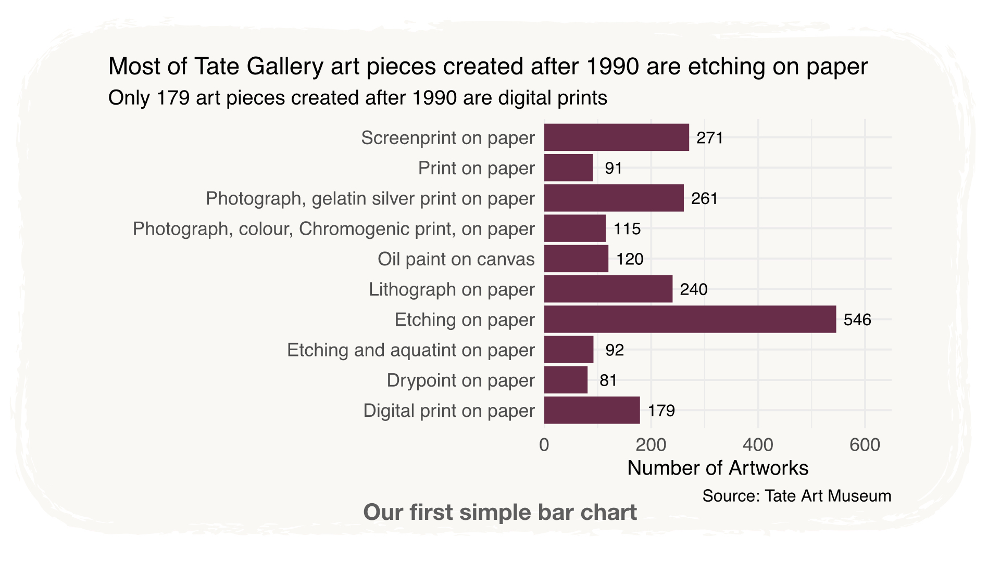
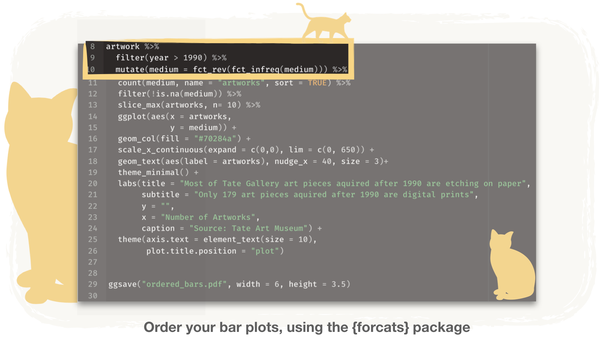
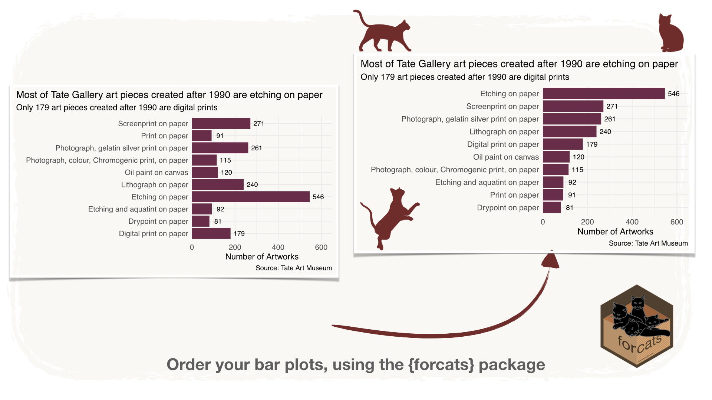
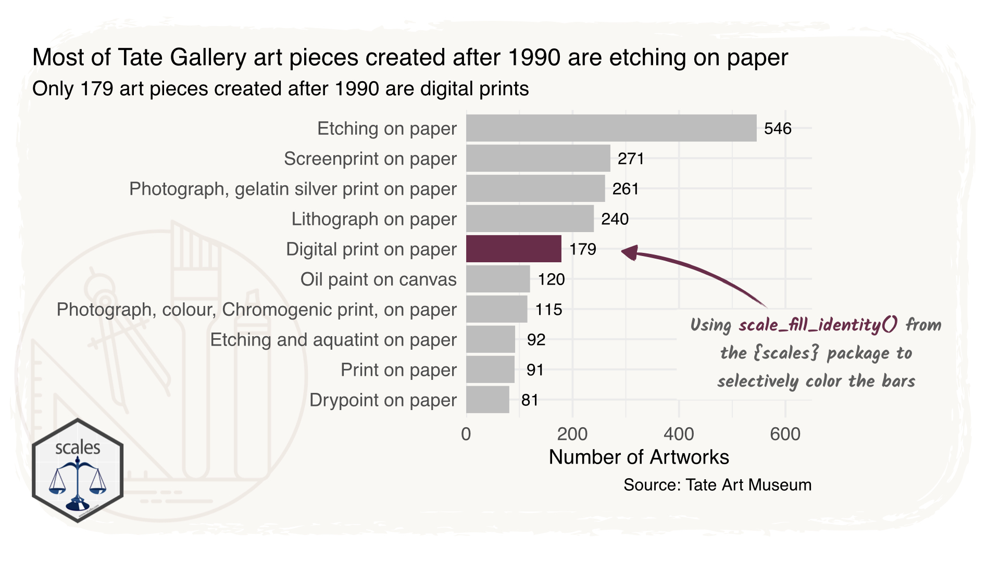
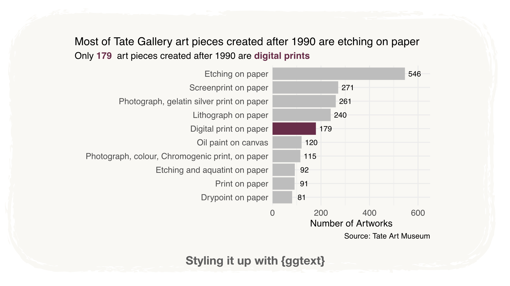
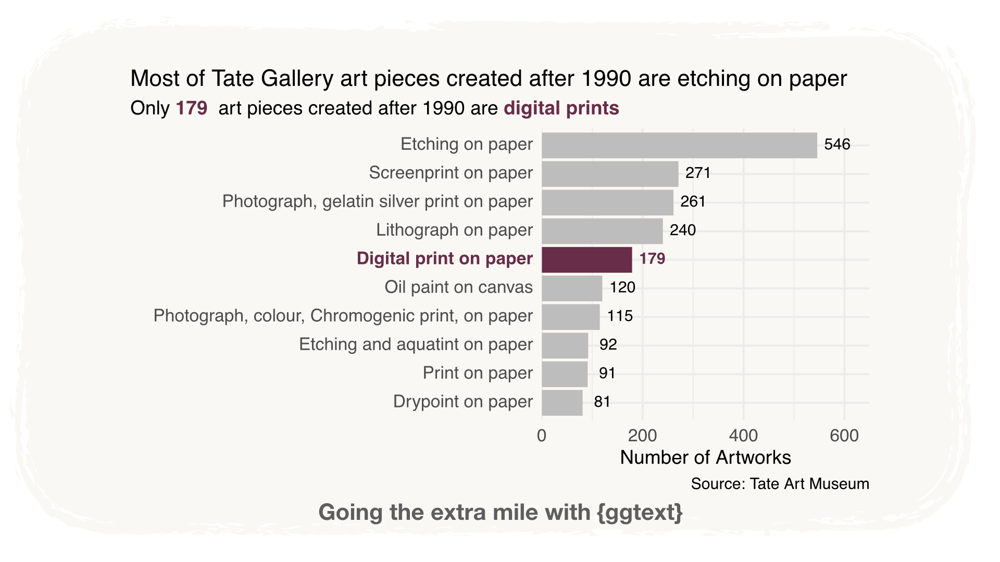

Better data communication with {ggplot2}
================

## Styling a chart using `{forcats}` and `{ggtext}` and `{scales}`

After seeing the talk of John Burn-Murdoch at R Studio conference I have
decided to show how to put in practice one of his tips for better data
communication: democratise plots with text. He indeed showed the
importance of the text in charts, as the audience will first look
through the title, the axis title and only after that it will focus on
the area of the chart. The title and subtitle then become a key tool for
our data communication, that should not be overlooked and that should
already try to convey a message, not just describe the type of data used
for the plot.

I will then try to look a few steps further in this data communication
endeavour and use color and styling to also help guiding the audience to
the salient features of the visualisation.

Since the R programming language is my go-to tool for data analysis I
will use it throughout this post. The dataset chosen as a case study is
the Tate Gallery artwork from week 3 of 2021
[tidytuesday](https://github.com/rfordatascience/tidytuesday/tree/master/data/2021).
Let’s pretend I am trying to convince the Tate gallery director to buy
more digital prints for the gallery, and I am interested in showing how
many art pieces of this type were acquired by the gallery in the past
couple of decades.

> Let’s start simple, with a bar plot, that shows the number of
> artpieces created after 1990, by medium.

Already here, using `labs()` we can add a title, a subtitle, a caption
and style the x and y axis labels. The chosen title and subtitle show
what I am trying to communicate with this chart:

1- More of the art pieces that made from 1990 onward are made of etching
on paper, 2- Only 179 art pieces are digital prints

This exemplifies the idea that the title should be use to already help
and guide your audience to read this chart correctly, as the main
messages are communicated in plain sight.

``` r
library(tidyverse)
```

``` r
artwork <- readr::read_csv('https://raw.githubusercontent.com/rfordatascience/tidytuesday/master/data/2021/2021-01-12/artwork.csv') # reading in the dataset
```

With little code and some basic styling I create a simple bar chart.

``` r
artwork %>% 
  filter(year > 1990) %>% # filtering out by the year
  count(medium, name = "artworks", sort = TRUE) %>% # counting artpieces by medium.
  filter(!is.na(medium)) %>% # removing art pieces with medium == NA
  slice_max(artworks, n= 10) %>% # keeping only the top ten values
  ggplot(aes(x = artworks, 
             y = medium)) +
  geom_col(fill = "#70284a") + # filling all the bars with a set color
  scale_x_continuous(expand = c(0,0), lim = c(0, 650)) + 
  geom_text(aes(label = artworks), nudge_x = 40, size = 3)+ # adding the text on top of the bars
  theme_minimal() +
  labs(title = "Most of Tate Gallery art pieces created after 1990 are etching on paper",
       subtitle = "Only 179 art pieces created after 1990 are digital prints",
       y = "",
       x = "Number of Artworks", 
       caption = "Source: Tate Art Museum") +
  theme(axis.text = element_text(size = 10),
        plot.title.position = "plot")
```



Let’s go a step further in the data visualisation, let’s order the bars
according to their height. To achieve this, we need to order the
underlying data. We can indeed treat the “medium” as a factor and order
it based on how many artworks were created by medium.

The go-to tool to achieve this, in the `{tidyverse}` world, is the
`{forcats}` package, a set of functions that help us deal with factors.
I will use `fct_infreq()` function, that is used to order a factor by
its frequency. I can then use it before `count()`, so before I summarise
the data. Since I want the bars to be in descending order, I can then
wrap it into `fct_rev()`, that will reverse the factors order.

With just this extra line in our code, `mutate(medium =
fct_rev(fct_infreq(medium)))` I have achieved my goal.

``` r
artwork %>% 
  filter(year > 1990) %>% 
  mutate(medium = fct_infreq(medium)) %>% 
  pull(medium) %>% 
  levels() %>% 
  head(10)
```

    ##  [1] "Etching on paper"                               
    ##  [2] "Screenprint on paper"                           
    ##  [3] "Photograph, gelatin silver print on paper"      
    ##  [4] "Lithograph on paper"                            
    ##  [5] "Digital print on paper"                         
    ##  [6] "Oil paint on canvas"                            
    ##  [7] "Photograph, colour, Chromogenic print, on paper"
    ##  [8] "Etching and aquatint on paper"                  
    ##  [9] "Print on paper"                                 
    ## [10] "Drypoint on paper"





> Yes, I think the main developers of the tidyverse are cat people.

This plot will indeed be the starting point for building our final
version, a little bit more styled and ready to be shared in the
presentation. Instead of coloring all the bars the same, I can
**selectively** color only the bar that I want to highlight and keep the
others in a rather more dull color. I can achieve this making best use
of the `{scales}` package, using `scale_fill_identity()`.

To use this function, I first need to create a new variable, that
contains the chosen color for each bar, as a string, that I can then
apply directly to the fill aesthetic. I can then modify the code in the
following way.

``` r
artwork %>% 
  filter(year > 1990) %>% 
  mutate(medium = fct_rev(fct_infreq(medium))) %>% 
  count(medium, name = "artworks", sort = TRUE) %>% 
  mutate(medium_col = if_else(medium == "Digital print on paper",
                             "#70284a" ,
                             "#bdbdbd")) %>% # adding the variable with the colors
  ... %>% 
  geom_col(aes(fill = medium_col)) + # mapping medium_col to the fill aesthetic
  scale_fill_identity() + # applying scale_fill_identity()
  scale_x_continuous(expand = c(0,0), lim = c(0, 650)) +
  scale_fill_identity()+
  ...
```

For readability, I have omitted parts of it, so you can focus on the
only parts that have changed.



Now let’s focus again on the text. Using `{ggtext}` I can style the text
in our plot to match the color of the highlighted bar. This package will
indeed allow us to use HTML and markdown syntax to apply the styles I
want to the chosen text in the chart. I will focus now on the subtitle,
coloring and emphasising the number of digital prints (179) and the
“digital prints” text itself.

What I need to do it to modify the subtitle text, incorporating the html
code such as `<b style='color:#70284a'>`, that sets the text in bold and
in the color specified by the hex string.

``` r
... %>% 
    labs(title = "Most of Tate Gallery art pieces created after 1990 are etching on paper",
       subtitle = paste0("Only <b style='color:#70284a'>179 </b style='color:#70284a'>",
       "art pieces created after 1990 are" ,
       "<b style='color:#70284a'>digital prints</b style='color:#70284a'>"),
       y = "",
       x = "Number of Artworks", 
       caption = "Source: Tate Art Museum") +
  theme(axis.text = element_text(size = 10),
        plot.title.position = "plot",
        plot.subtitle = ggtext::element_markdown()) #use this to make sure ggplot2 reads and applies the html syntax when rendering the plot
```



Now let’s go the extra mile with `{ggtext}` and style also the text
inside the plot. The concept will not differ from before, but the code
needs a little modification.

First, I will create the `medium_styled` column, that incorporates the
text and the y label, to which I have selectively added the html code
using `if_else()` and `glue()`. This allows me to create a new variable,
that I can then use for the y axis of the plot. For easiness, I have
done this after the count and for not messing up with the factors, I am
reordering the factors, based on the `artworks` values after the
`count()`, using a different `{forcats}` function: `fct_reorder()`. I
can apply the same resoning to the `artworks` variable, to the apply it
to the numbers on top of the bars. In this way, everything that relates
with Digital prints on paper will have the same color. Once I have
created the styled variables, I can apply them to the plot by mapping
the y axis and the text labels to them. For styling the y axis, I can
follow the same concept as for the subtitle: I can add `axis.text.y =
ggtext::element_markdown()`to the `theme()`, but for the `geom_text()` I
actually need to use a different geom, borrowed from the `{ggtext}`
package, `geom_richtext()`. `geom_richtext()` is actually the natural
substitute for `geom_label()`, so to remove the borders you need to add
few extra arguments such as `fill = NA`and `label.color = NA`.

You can find the final code below, have fun with it.

``` r
artwork %>% 
  filter(year > 1990) %>% 
  count(medium, name = "artworks", sort = TRUE) %>% 
  mutate(medium_col = if_else(medium == "Digital print on paper",
                             "#70284a" ,
                             "#bdbdbd")) %>% 
  mutate(medium_styled = if_else(medium == "Digital print on paper",
                                glue::glue("<b style='color:#70284a'>{medium}</b>"),
                                as.character(medium))) %>% 
  mutate(medium_styled = fct_reorder(.f = medium_styled, .x = artworks)) %>% 
  filter(!is.na(medium)) %>% 
  slice_max(artworks, n= 10) %>% 
  mutate(artworks_styled = if_else(medium == "Digital print on paper",
                                glue::glue("<b style='color:#70284a'>{artworks}</b>"),
                                as.character(artworks))) %>% 
  ggplot(aes(x = artworks, 
             y = medium_styled)) +
  geom_col(aes(fill = medium_col)) +
  scale_x_continuous(expand = c(0,0), lim = c(0, 650)) +
  scale_fill_identity()+
  ggtext::geom_richtext(aes(label = artworks_styled),
                        nudge_x = 40, 
                        size = 3,
                        fill = NA, label.color = NA)+ 
  theme_minimal() +
  labs(title = "Most of Tate Gallery art pieces created after 1990 are etching on paper",
       subtitle = "Only <b style='color:#70284a'>179 </b style='color:#70284a'> art pieces created after 1990 are <b style='color:#70284a'>digital prints</b style='color:#70284a'>",
       y = "",
       x = "Number of Artworks", 
       caption = "Source: Tate Art Museum") +
  theme(axis.text = element_text(size = 10),
        plot.title.position = "plot",
        plot.subtitle = ggtext::element_markdown(),
        axis.text.y = ggtext::element_markdown(),
        )
```



I hope that this little exercise can help you understand how useful it
is to learn a bit how to use `{scales}`,`{ggtext}` and `{forcats}`
packages and how these can be wonderful tools to style your plot a bit,
so to help the data communication. I would also like to stress a further
point:

> Keep it simple

Do not clog your visualisation but rather think of what you are really
trying to communicate with it. Also leave some blank spacem the data
needs to “breath”.

When you are learning a tool like {`ggplot2`} it is very easy to feel so
empowered that you start trying to implement every single feature that
you have learnt or that you want to learn. Rather refrain from it, just
like when you are learning how to use Photoshop for modifying
photographs you may tend to make your pictures all look a bit too
overrealistic, oversaturated and oversharp, do not fall in the same trap
with dataviz. In the end, data communication is just like any other
communication type: you are doing it for communicating a concepts, in
the easiest and most effective way possible, in an accessible way for
the biggest possible audience, you are not doing it to show how good you
are with `{ggplot2}` or any other tool of your choice. Trust me, we all
fell into that trap at some point.

I hope you have enjoyed this little exercise and hopefully had learnt
some little tips on how to perfectionate your charts, to make them as
readable as possible.
